# UnivAI final-project diagram sources

This file contains editable Mermaid sources for the formal final-project package. The diagrams are intentionally split into presentation-sized views so they can be exported independently for the Word document.

Status convention:

- **Implemented** means the node or flow is backed by current repository code or deployment configuration.
- **Reference** means it exists as a versioned contract, scaffold, or schema, but repository inspection did not establish it as the active runtime path.
- **Proposed** means it is a documentation or planning view, not a claim that the work has already happened.
- PostgreSQL dotted ERD relationships represent logical tenant ownership through `registrationNumber` or another text identifier rather than a physical foreign key.
- ERDs are intentionally logical: they show identifiers, ownership, state, and major relationships rather than every storage column.

## 1. System context — implemented runtime

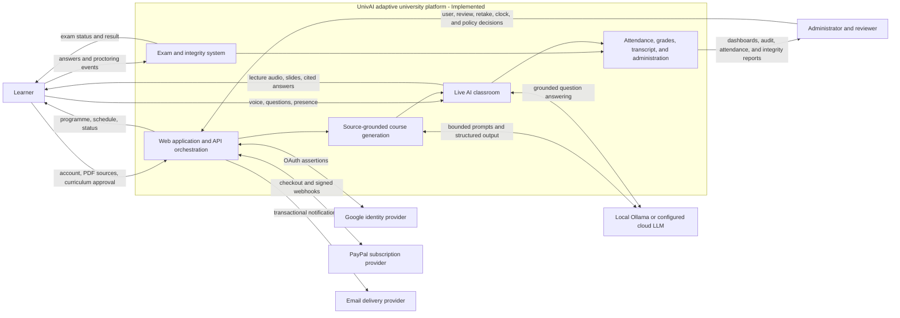
```mermaid
flowchart LR
    Learner["Learner"]
    Admin["Administrator and reviewer"]

    subgraph Platform["UnivAI adaptive university platform - Implemented"]
        App["Web application and API orchestration"]
        Learning["Source-grounded course generation"]
        Classroom["Live AI classroom"]
        Assessment["Exam and integrity system"]
        Results["Attendance, grades, transcript, and administration"]
    end

    Google["Google identity provider"]
    PayPal["PayPal subscription provider"]
    Email["Email delivery provider"]
    Model["Local Ollama or configured cloud LLM"]

    Learner -->|"account, PDF sources, curriculum approval"| App
    App -->|"programme, schedule, status"| Learner
    Learner -->|"voice, questions, presence"| Classroom
    Classroom -->|"lecture audio, slides, cited answers"| Learner
    Learner -->|"answers and proctoring events"| Assessment
    Assessment -->|"exam status and result"| Learner

    Admin -->|"user, review, retake, clock, and policy decisions"| App
    Results -->|"dashboards, audit, attendance, and integrity reports"| Admin

    App --> Learning
    Learning --> Classroom
    Assessment --> Results
    Classroom --> Results

    App <-->|"OAuth assertions"| Google
    App <-->|"checkout and signed webhooks"| PayPal
    App -->|"transactional notifications"| Email
    Learning <-->|"bounded prompts and structured output"| Model
    Classroom <-->|"grounded question answering"| Model
```

## 2. Component and production deployment architecture

```mermaid
flowchart TB
    subgraph Internet["Internet and external providers"]
        Browser["Learner and admin browsers"]
        Google["Google OAuth"]
        PayPal["PayPal"]
        Resend["Email provider"]
        CloudLLM["Optional cloud LLM"]
    end

    subgraph PublicEdge["Public edge - Implemented"]
        Caddy["Caddy<br/>TLS, routing, security headers"]
        LiveMedia["LiveKit media ports<br/>TCP 7881 and UDP media range"]
    end

    subgraph PrivateServices["Private application network - Implemented"]
        App["UnivAI App<br/>Next.js UI, API, Better Auth, orchestration"]
        Agent["Agent and RAG MCP<br/>ingestion, retrieval, planning"]
        Generator["Course generator<br/>local App-spawned Python process"]
        Worker["Live worker<br/>lecture control, STT, TTS, Q and A"]
        LiveKit["LiveKit server<br/>rooms, signaling, realtime media"]
        Exam["Exam service<br/>attempts, sessions, grading, integrity"]
        Dispatcher["Notification dispatcher"]
        Health["Health aggregator"]
    end

    subgraph DataPlane["Private data and persistent storage - Implemented"]
        PG[("PostgreSQL<br/>identity, courses, attendance, results")]
        QD[("Qdrant<br/>dense and sparse source vectors")]
        Mongo[("MongoDB<br/>exam domain and proctoring")]
        Uploads[("Tenant upload storage<br/>PDF sources")]
        Cache[("Artifact, slide, render, and audio caches")]
    end

    LocalLLM["Host Ollama or configured model endpoint"]
    ExamGap["Deployment verification required<br/>public browser origin for Exam service"]
    GeneratorGap["Deployment verification required<br/>generator packaging outside local spawn model"]

    Browser -->|"HTTPS"| Caddy
    Caddy --> App
    Caddy -->|"signaling path"| LiveKit
    Browser <--> LiveMedia
    LiveMedia <--> LiveKit

    App --> PG
    App --> Uploads
    App --> Agent
    App -->|"spawn in local runtime"| Generator
    App -->|"signed launch request"| Exam
    App -->|"exam-world and question-bank synchronization"| Mongo

    Agent --> QD
    Agent --> Uploads
    Agent <--> LocalLLM
    Agent <--> CloudLLM

    Generator --> Uploads
    Generator --> PG
    Generator --> Cache
    Generator <--> LocalLLM

    Worker <--> LiveKit
    Worker --> PG
    Worker --> Agent
    Worker --> Cache
    Worker <--> LocalLLM

    Exam --> Mongo
    Exam -->|"signed result callback"| App
    Dispatcher -->|"internal dispatch endpoint"| App
    Health --> App
    Health --> Agent
    Health --> Exam
    Health --> LiveKit

    App <--> Google
    App <--> PayPal
    App --> Resend

    ExamGap -.-> Exam
    GeneratorGap -.-> Generator
```

Deployment note: the committed production topology is implemented in Compose, but the two dashed callouts identify integration points that require deployment verification rather than representing completed public routes.

## 3. Data-flow diagram Level 0 — implemented context

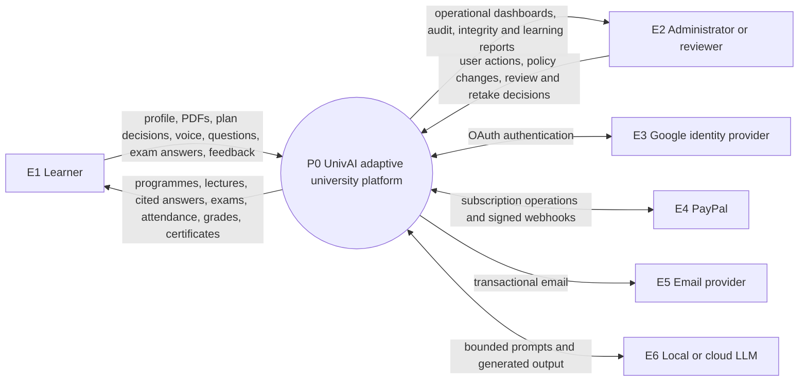
```mermaid
flowchart LR
    E1["E1 Learner"]
    E2["E2 Administrator or reviewer"]
    E3["E3 Google identity provider"]
    E4["E4 PayPal"]
    E5["E5 Email provider"]
    E6["E6 Local or cloud LLM"]

    P0(("P0 UnivAI adaptive university platform"))

    E1 -->|"profile, PDFs, plan decisions, voice, questions, exam answers, feedback"| P0
    P0 -->|"programmes, lectures, cited answers, exams, attendance, grades, certificates"| E1

    E2 -->|"user actions, policy changes, review and retake decisions"| P0
    P0 -->|"operational dashboards, audit, integrity and learning reports"| E2

    P0 <-->|"OAuth authentication"| E3
    P0 <-->|"subscription operations and signed webhooks"| E4
    P0 -->|"transactional email"| E5
    P0 <-->|"bounded prompts and generated output"| E6
```

## 4. Data-flow diagram Level 1 — implemented processes and stores

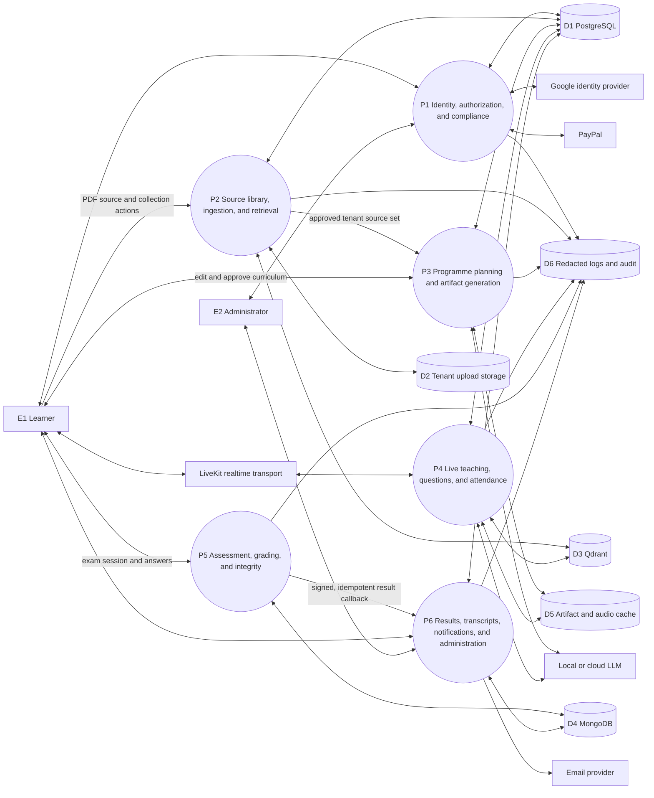
```mermaid
flowchart LR
    Learner["E1 Learner"]
    Admin["E2 Administrator"]

    P1(("P1 Identity, authorization, and compliance"))
    P2(("P2 Source library, ingestion, and retrieval"))
    P3(("P3 Programme planning and artifact generation"))
    P4(("P4 Live teaching, questions, and attendance"))
    P5(("P5 Assessment, grading, and integrity"))
    P6(("P6 Results, transcripts, notifications, and administration"))

    D1[("D1 PostgreSQL")]
    D2[("D2 Tenant upload storage")]
    D3[("D3 Qdrant")]
    D4[("D4 MongoDB")]
    D5[("D5 Artifact and audio cache")]
    D6[("D6 Redacted logs and audit")]

    IdP["Google identity provider"]
    Payment["PayPal"]
    Mail["Email provider"]
    Model["Local or cloud LLM"]
    Realtime["LiveKit realtime transport"]

    Learner <--> P1
    Admin <--> P1
    P1 <--> D1
    P1 <--> IdP
    P1 <--> Payment

    Learner -->|"PDF source and collection actions"| P2
    P2 <--> D1
    P2 <--> D2
    P2 <--> D3

    P2 -->|"approved tenant source set"| P3
    Learner <-->|"edit and approve curriculum"| P3
    P3 <--> D1
    P3 <--> D5
    P3 <--> Model

    Learner <--> Realtime
    Realtime <--> P4
    P4 <--> D1
    P4 <--> D3
    P4 <--> D5
    P4 <--> Model

    Learner <-->|"exam session and answers"| P5
    P5 <--> D4
    P5 -->|"signed, idempotent result callback"| P6

    Learner <--> P6
    Admin <--> P6
    P6 <--> D1
    P6 <--> D4
    P6 --> Mail

    P1 --> D6
    P2 --> D6
    P3 --> D6
    P4 --> D6
    P5 --> D6
    P6 --> D6
```

## 5. LangGraph agentic loop

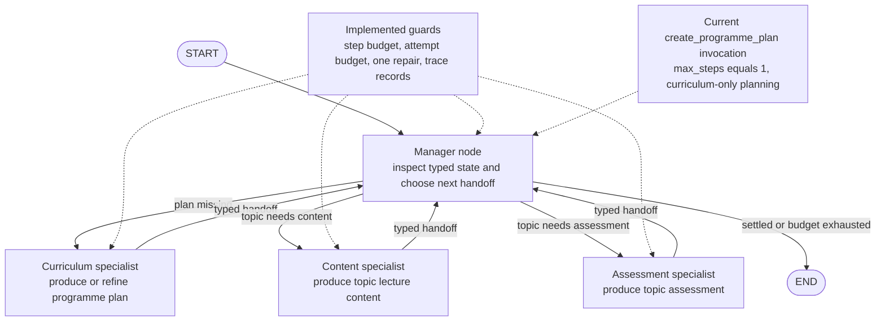
```mermaid
flowchart TD
    Start(["START"])
    Manager["Manager node<br/>inspect typed state and choose next handoff"]
    Curriculum["Curriculum specialist<br/>produce or refine programme plan"]
    Content["Content specialist<br/>produce topic lecture content"]
    Assessment["Assessment specialist<br/>produce topic assessment"]
    End(["END"])
    Guard["Implemented guards<br/>step budget, attempt budget, one repair, trace records"]
    Current["Current create_programme_plan invocation<br/>max_steps equals 1, curriculum-only planning"]

    Start --> Manager
    Manager -->|"plan missing"| Curriculum
    Curriculum -->|"typed handoff"| Manager
    Manager -->|"topic needs content"| Content
    Content -->|"typed handoff"| Manager
    Manager -->|"topic needs assessment"| Assessment
    Assessment -->|"typed handoff"| Manager
    Manager -->|"settled or budget exhausted"| End

    Guard -.-> Manager
    Guard -.-> Curriculum
    Guard -.-> Content
    Guard -.-> Assessment
    Current -.-> Manager
```

The full graph definition and specialist nodes are implemented. The current programme-plan MCP invocation deliberately reaches only the curriculum-planning portion; lecture and assessment artifact production uses separate generation workflows.

## 6. RAG ingestion and retrieval pipeline — implemented

```mermaid
flowchart LR
    subgraph Ingestion["Ingestion path"]
        PDF["Tenant PDF"]
        PathCheck["Resolve path inside tenant upload root<br/>validate allowed extension"]
        Extract["Extract pages and chunks"]
        DenseEmbed["Dense embedding"]
        SparseEmbed["Sparse BM25 representation"]
        Upsert["Upsert point with page, chunk, hashes,<br/>user, collection, document, and source metadata"]
    end

    Qdrant[("Qdrant collection<br/>named dense and sparse vectors")]

    subgraph Retrieval["Retrieval path"]
        Question["Confirmed learner question"]
        Normalize["Normalize and optionally decompose query"]
        Grant["Check tenant and document grant"]
        DenseSearch["Dense search with tenant filter"]
        SparseSearch["Sparse search with tenant filter"]
        Fusion["Reciprocal-rank fusion"]
        Dedupe["Merge and deduplicate chunks"]
        Rerank["Cross-encoder reranking"]
        Envelope["Grounded context envelope<br/>citations plus untrusted-data marking"]
        Consumer["Live Q and A or planning consumer"]
        LLM["Grounded LLM generation"]
        Answer["Short answer with source citations"]
    end

    PDF --> PathCheck --> Extract
    Extract --> DenseEmbed
    Extract --> SparseEmbed
    DenseEmbed --> Upsert
    SparseEmbed --> Upsert
    Upsert --> Qdrant

    Question --> Normalize --> Grant
    Grant --> DenseSearch
    Grant --> SparseSearch
    Qdrant --> DenseSearch
    Qdrant --> SparseSearch
    DenseSearch --> Fusion
    SparseSearch --> Fusion
    Fusion --> Dedupe --> Rerank --> Envelope --> Consumer --> LLM --> Answer
```

## 7. Upload, planning, approval, and generation sequence

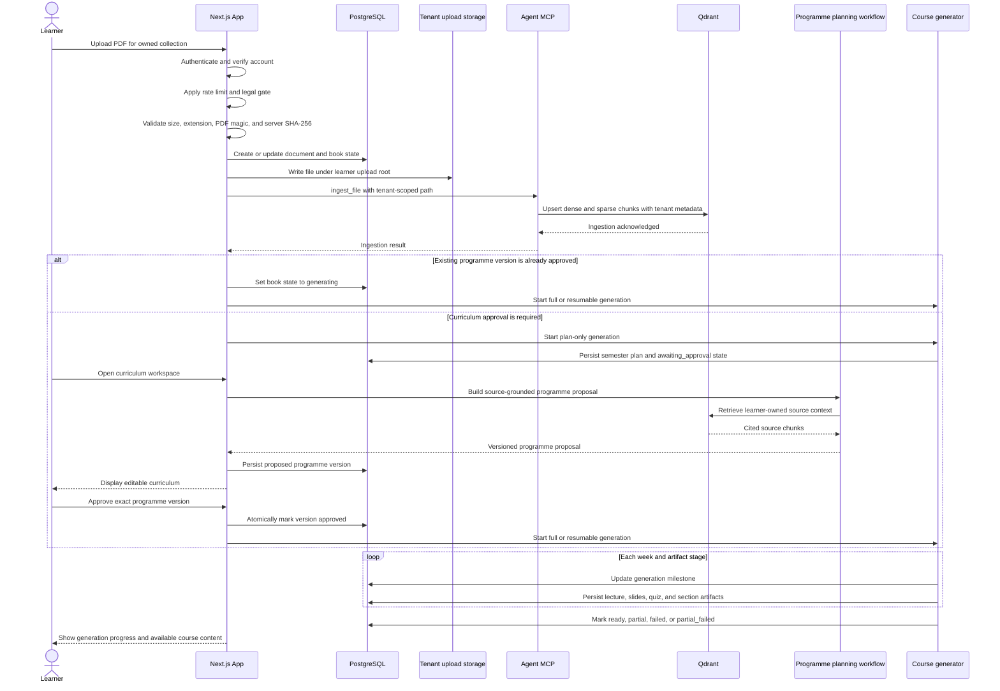
```mermaid
sequenceDiagram
    actor Learner
    participant App as Next.js App
    participant PG as PostgreSQL
    participant FS as Tenant upload storage
    participant Agent as Agent MCP
    participant QD as Qdrant
    participant Planner as Programme planning workflow
    participant Gen as Course generator

    Learner->>App: Upload PDF for owned collection
    App->>App: Authenticate and verify account
    App->>App: Apply rate limit and legal gate
    App->>App: Validate size, extension, PDF magic, and server SHA-256
    App->>PG: Create or update document and book state
    App->>FS: Write file under learner upload root
    App->>Agent: ingest_file with tenant-scoped path
    Agent->>QD: Upsert dense and sparse chunks with tenant metadata
    QD-->>Agent: Ingestion acknowledged
    Agent-->>App: Ingestion result

    alt Existing programme version is already approved
        App->>PG: Set book state to generating
        App->>Gen: Start full or resumable generation
    else Curriculum approval is required
        App->>Gen: Start plan-only generation
        Gen->>PG: Persist semester plan and awaiting_approval state
        Learner->>App: Open curriculum workspace
        App->>Planner: Build source-grounded programme proposal
        Planner->>QD: Retrieve learner-owned source context
        QD-->>Planner: Cited source chunks
        Planner-->>App: Versioned programme proposal
        App->>PG: Persist proposed programme version
        App-->>Learner: Display editable curriculum
        Learner->>App: Approve exact programme version
        App->>PG: Atomically mark version approved
        App->>Gen: Start full or resumable generation
    end

    loop Each week and artifact stage
        Gen->>PG: Update generation milestone
        Gen->>PG: Persist lecture, slides, quiz, and section artifacts
    end
    Gen->>PG: Mark ready, partial, failed, or partial_failed
    App-->>Learner: Show generation progress and available course content
```

The local process-spawn integration is implemented. Its production packaging is intentionally shown as requiring verification in the deployment diagram.

## 8. Live lecture, disconnect recovery, and raised-hand sequence

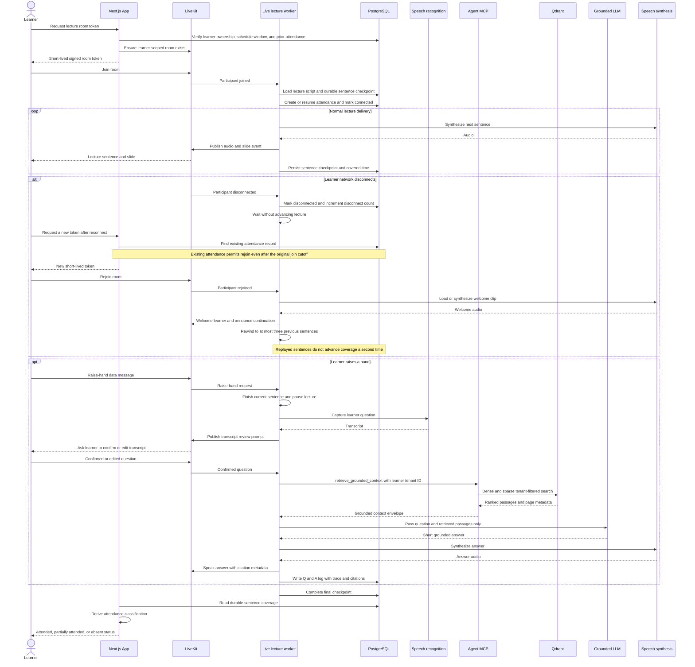
```mermaid
sequenceDiagram
    actor Learner
    participant App as Next.js App
    participant LK as LiveKit
    participant Worker as Live lecture worker
    participant PG as PostgreSQL
    participant STT as Speech recognition
    participant Agent as Agent MCP
    participant QD as Qdrant
    participant LLM as Grounded LLM
    participant TTS as Speech synthesis

    Learner->>App: Request lecture room token
    App->>PG: Verify learner ownership, schedule window, and prior attendance
    App->>LK: Ensure learner-scoped room exists
    App-->>Learner: Short-lived signed room token
    Learner->>LK: Join room
    LK->>Worker: Participant joined
    Worker->>PG: Load lecture script and durable sentence checkpoint
    Worker->>PG: Create or resume attendance and mark connected

    loop Normal lecture delivery
        Worker->>TTS: Synthesize next sentence
        TTS-->>Worker: Audio
        Worker->>LK: Publish audio and slide event
        LK-->>Learner: Lecture sentence and slide
        Worker->>PG: Persist sentence checkpoint and covered time
    end

    alt Learner network disconnects
        LK->>Worker: Participant disconnected
        Worker->>PG: Mark disconnected and increment disconnect count
        Worker->>Worker: Wait without advancing lecture
        Learner->>App: Request a new token after reconnect
        App->>PG: Find existing attendance record
        Note over App,PG: Existing attendance permits rejoin even after the original join cutoff
        App-->>Learner: New short-lived token
        Learner->>LK: Rejoin room
        LK->>Worker: Participant rejoined
        Worker->>TTS: Load or synthesize welcome clip
        TTS-->>Worker: Welcome audio
        Worker->>LK: Welcome learner and announce continuation
        Worker->>Worker: Rewind to at most three previous sentences
        Note over Worker,PG: Replayed sentences do not advance coverage a second time
    end

    opt Learner raises a hand
        Learner->>LK: Raise-hand data message
        LK->>Worker: Raise-hand request
        Worker->>Worker: Finish current sentence and pause lecture
        Worker->>STT: Capture learner question
        STT-->>Worker: Transcript
        Worker->>LK: Publish transcript review prompt
        LK-->>Learner: Ask learner to confirm or edit transcript
        Learner->>LK: Confirmed or edited question
        LK->>Worker: Confirmed question
        Worker->>Agent: retrieve_grounded_context with learner tenant ID
        Agent->>QD: Dense and sparse tenant-filtered search
        QD-->>Agent: Ranked passages and page metadata
        Agent-->>Worker: Grounded context envelope
        Worker->>LLM: Pass question and retrieved passages only
        LLM-->>Worker: Short grounded answer
        Worker->>TTS: Synthesize answer
        TTS-->>Worker: Answer audio
        Worker->>LK: Speak answer with citation metadata
        Worker->>PG: Write Q and A log with trace and citations
    end

    Worker->>PG: Complete final checkpoint
    App->>PG: Read durable sentence coverage
    App->>App: Derive attendance classification
    App-->>Learner: Attended, partially attended, or absent status
```

## 9. PostgreSQL identity, governance, and operations ERD — implemented

`APP_USER` maps to the quoted PostgreSQL table named `user`.

```mermaid
erDiagram
    APP_USER {
        uuid id PK
        string registration_number UK
        string email UK
        string name
        string role
        boolean banned
        string ui_locale
    }

    SESSION {
        uuid id PK
        uuid user_id FK
        string token UK
        datetime expires_at
    }

    ACCOUNT {
        uuid id PK
        uuid user_id FK
        string provider_id
        string account_id
    }

    VERIFICATION {
        uuid id PK
        string identifier
        string value
        datetime expires_at
    }

    LEGAL_ACCEPTANCE {
        int id PK
        uuid user_id FK
        string document_type
        string document_version
        datetime accepted_at
    }

    PRIVACY_PREFERENCE {
        uuid user_id PK, FK
        boolean sale_or_sharing_opt_out
        boolean limit_sensitive_data_use
    }

    PRIVACY_REQUEST {
        uuid id PK
        uuid user_id FK
        string request_type
        string status
        datetime due_at
    }

    USER_SUBSCRIPTION {
        uuid user_id PK, FK
        string plan_code
        string status
        string provider
    }

    COIN_WALLET {
        uuid user_id PK, FK
        int balance
        int weekly_allowance
    }

    COIN_TRANSACTION {
        uuid id PK
        uuid user_id FK
        int amount
        int balance_after
        string idempotency_key UK
    }

    NOTIFICATION_PREFERENCE {
        uuid user_id PK, FK
        string category PK
        boolean email_enabled
    }

    NOTIFICATION_OUTBOX {
        uuid id PK
        uuid user_id FK
        string event_key UK
        string status
    }

    NOTIFICATION_DELIVERY_LOG {
        uuid id PK
        uuid user_id FK
        string category
        string status
    }

    RATE_LIMIT_POLICY {
        uuid user_id PK, FK
        string scope PK
        int max_requests
        int window_seconds
    }

    RATE_LIMIT_USAGE {
        uuid user_id PK, FK
        string scope PK
        datetime bucket_start PK
        int request_count
    }

    FINAL_EXAM_CASE {
        string student_id PK
        string curriculum_id PK
        uuid declined_by FK
        string official_exam_id
        datetime finalized_at
    }

    AI_OUTPUT_REPORT {
        int id PK
        string student_id
        uuid reviewed_by FK
        string target_type
        string status
    }

    AUTH_AUDIT {
        int id PK
        string actor_id
        string target_id
        string action
        datetime created_at
    }

    APP_USER ||--o{ SESSION : has
    APP_USER ||--o{ ACCOUNT : authenticates_with
    APP_USER ||--o{ LEGAL_ACCEPTANCE : accepts
    APP_USER ||--o| PRIVACY_PREFERENCE : configures
    APP_USER ||--o{ PRIVACY_REQUEST : submits
    APP_USER ||--o| USER_SUBSCRIPTION : holds
    APP_USER ||--o| COIN_WALLET : owns
    APP_USER ||--o{ COIN_TRANSACTION : receives
    APP_USER ||--o{ NOTIFICATION_PREFERENCE : configures
    APP_USER ||--o{ NOTIFICATION_OUTBOX : receives
    APP_USER ||--o{ NOTIFICATION_DELIVERY_LOG : receives
    APP_USER ||--o{ RATE_LIMIT_POLICY : governed_by
    APP_USER ||--o{ RATE_LIMIT_USAGE : consumes
    APP_USER o|--o{ FINAL_EXAM_CASE : may_decline
    APP_USER o|--o{ AI_OUTPUT_REPORT : reviews
    APP_USER ||..o{ FINAL_EXAM_CASE : owns_logically
    APP_USER ||..o{ AI_OUTPUT_REPORT : submits_logically
    APP_USER ||..o{ AUTH_AUDIT : actor_or_target
```

`VERIFICATION` and payment webhook event records are intentionally not joined to `APP_USER` by a physical foreign key.

## 10. PostgreSQL learning and result ERD — implemented

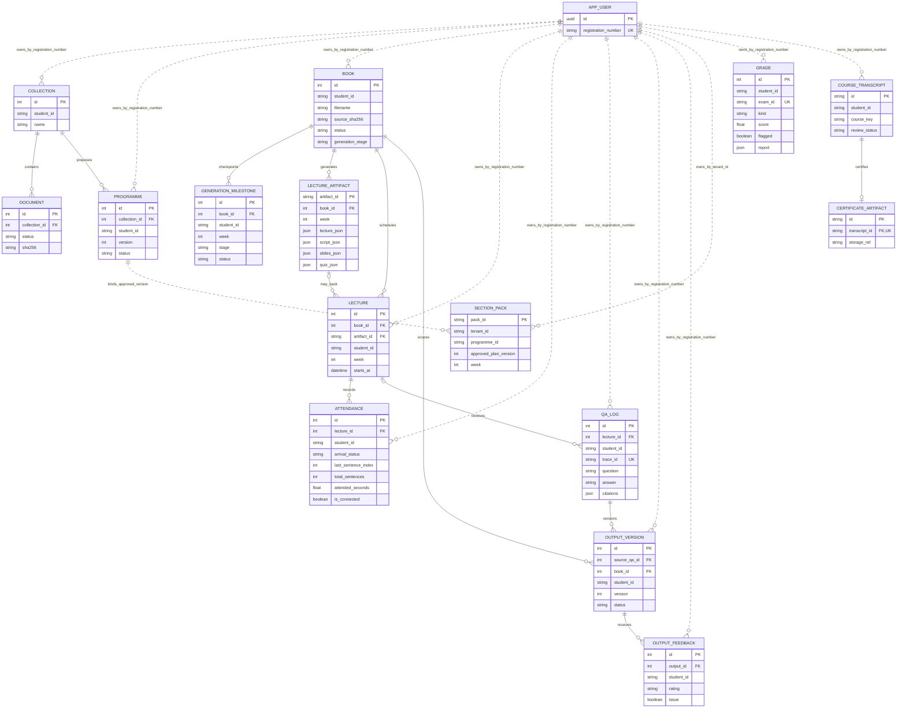
```mermaid
erDiagram
    APP_USER {
        uuid id PK
        string registration_number UK
    }

    COLLECTION {
        int id PK
        string student_id
        string name
    }

    DOCUMENT {
        int id PK
        int collection_id FK
        string status
        string sha256
    }

    PROGRAMME {
        int id PK
        int collection_id FK
        string student_id
        int version
        string status
    }

    BOOK {
        int id PK
        string student_id
        string filename
        string source_sha256
        string status
        string generation_stage
    }

    GENERATION_MILESTONE {
        int id PK
        int book_id FK
        string student_id
        int week
        string stage
        string status
    }

    LECTURE_ARTIFACT {
        string artifact_id PK
        int book_id FK
        int week
        json lecture_json
        json script_json
        json slides_json
        json quiz_json
    }

    LECTURE {
        int id PK
        int book_id FK
        string artifact_id FK
        string student_id
        int week
        datetime starts_at
    }

    ATTENDANCE {
        int id PK
        int lecture_id FK
        string student_id
        string arrival_status
        int last_sentence_index
        int total_sentences
        float attended_seconds
        boolean is_connected
    }

    QA_LOG {
        int id PK
        int lecture_id FK
        string student_id
        string trace_id UK
        string question
        string answer
        json citations
    }

    OUTPUT_VERSION {
        int id PK
        int source_qa_id FK
        int book_id FK
        string student_id
        int version
        string status
    }

    OUTPUT_FEEDBACK {
        int id PK
        int output_id FK
        string student_id
        string rating
        boolean issue
    }

    SECTION_PACK {
        string pack_id PK
        string tenant_id
        string programme_id
        int approved_plan_version
        int week
    }

    GRADE {
        int id PK
        string student_id
        string exam_id UK
        string kind
        float score
        boolean flagged
        json report
    }

    COURSE_TRANSCRIPT {
        string id PK
        string student_id
        string course_key
        string review_status
    }

    CERTIFICATE_ARTIFACT {
        string id PK
        string transcript_id FK, UK
        string storage_ref
    }

    COLLECTION ||--o{ DOCUMENT : contains
    COLLECTION ||--o{ PROGRAMME : proposes
    BOOK ||--o{ GENERATION_MILESTONE : checkpoints
    BOOK ||--o{ LECTURE_ARTIFACT : generates
    BOOK ||--o{ LECTURE : schedules
    LECTURE_ARTIFACT o|--o{ LECTURE : may_back
    LECTURE ||--o{ ATTENDANCE : records
    LECTURE o|--o{ QA_LOG : receives
    QA_LOG ||--o{ OUTPUT_VERSION : versions
    BOOK ||--o{ OUTPUT_VERSION : scopes
    OUTPUT_VERSION ||--o{ OUTPUT_FEEDBACK : receives
    COURSE_TRANSCRIPT ||--o| CERTIFICATE_ARTIFACT : certifies

    APP_USER ||..o{ COLLECTION : owns_by_registration_number
    APP_USER ||..o{ PROGRAMME : owns_by_registration_number
    APP_USER ||..o{ BOOK : owns_by_registration_number
    APP_USER ||..o{ LECTURE : owns_by_registration_number
    APP_USER ||..o{ ATTENDANCE : owns_by_registration_number
    APP_USER ||..o{ QA_LOG : owns_by_registration_number
    APP_USER ||..o{ OUTPUT_VERSION : owns_by_registration_number
    APP_USER ||..o{ OUTPUT_FEEDBACK : owns_by_registration_number
    APP_USER ||..o{ SECTION_PACK : owns_by_tenant_id
    APP_USER ||..o{ GRADE : owns_by_registration_number
    APP_USER ||..o{ COURSE_TRANSCRIPT : owns_by_registration_number
    PROGRAMME ||..o{ SECTION_PACK : binds_approved_version
```

`OUTPUT_FEEDBACK`, exam callback status, and callback-event tables are also created defensively by application runtime code. They should be migrated into the single versioned schema before claiming migration-only database governance.

## 11. MongoDB exam-domain logical ERD — implemented

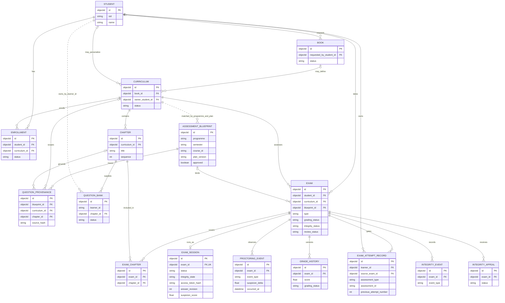
```mermaid
erDiagram
    STUDENT {
        objectid id PK
        string sid
        string name
    }

    BOOK {
        objectid id PK
        objectid requested_by_student_id FK
        string status
    }

    CURRICULUM {
        objectid id PK
        objectid book_id FK
        objectid owner_student_id FK
        string status
    }

    ENROLLMENT {
        objectid id PK
        objectid student_id FK
        objectid curriculum_id FK
        string status
    }

    CHAPTER {
        objectid id PK
        objectid curriculum_id FK
        string title
        int sequence
    }

    ASSESSMENT_BLUEPRINT {
        objectid id PK
        string programme
        string semester
        string course_id
        string plan_version
        boolean approved
    }

    QUESTION_PROVENANCE {
        objectid id PK
        objectid blueprint_id FK
        objectid curriculum_id FK
        objectid chapter_id FK
        string source_hash
    }

    QUESTION_BANK {
        objectid id PK
        string learner_id
        objectid chapter_id FK
        string status
    }

    EXAM {
        objectid id PK
        objectid student_id FK
        objectid curriculum_id FK
        objectid blueprint_id FK
        string type
        string grading_status
        string integrity_status
        string review_status
    }

    EXAM_CHAPTER {
        objectid id PK
        objectid exam_id FK
        objectid chapter_id FK
    }

    EXAM_SESSION {
        objectid id PK
        objectid exam_id FK, UK
        string status
        string integrity_state
        string access_token_hash
        int answer_revision
        float suspicion_score
    }

    EXAM_ATTEMPT_RECORD {
        objectid id PK
        objectid learner_id FK
        objectid source_exam_id FK
        string assessment_type
        string assessment_id
        int previous_attempt_number
    }

    PROCTORING_EVENT {
        objectid id PK
        objectid exam_id FK
        string event_type
        float suspicion_delta
        datetime occurred_at
    }

    GRADE_HISTORY {
        objectid id PK
        objectid exam_id FK
        float score
        string grading_status
    }

    INTEGRITY_EVENT {
        objectid id PK
        objectid exam_id FK
        string event_type
    }

    INTEGRITY_APPEAL {
        objectid id PK
        objectid exam_id FK
        string status
    }

    STUDENT o|--o{ BOOK : requests
    BOOK o|--o{ CURRICULUM : may_define
    STUDENT o|--o{ CURRICULUM : may_personalize
    STUDENT ||--o{ ENROLLMENT : has
    CURRICULUM ||--o{ ENROLLMENT : enrolls
    CURRICULUM ||--o{ CHAPTER : contains
    CURRICULUM ||..o{ ASSESSMENT_BLUEPRINT : matched_by_programme_and_plan
    ASSESSMENT_BLUEPRINT ||--o{ QUESTION_PROVENANCE : traces
    CURRICULUM o|--o{ QUESTION_PROVENANCE : scopes
    CHAPTER o|--o{ QUESTION_PROVENANCE : grounds
    CHAPTER ||--o{ QUESTION_BANK : supplies
    STUDENT ||..o{ QUESTION_BANK : owns_by_learner_id
    STUDENT ||--o{ EXAM : takes
    CURRICULUM ||--o{ EXAM : assesses
    ASSESSMENT_BLUEPRINT o|--o{ EXAM : binds
    EXAM ||--o{ EXAM_CHAPTER : covers
    CHAPTER ||--o{ EXAM_CHAPTER : included_in
    EXAM ||--o| EXAM_SESSION : runs_as
    EXAM ||--o{ EXAM_ATTEMPT_RECORD : gates
    STUDENT ||--o{ EXAM_ATTEMPT_RECORD : owns
    EXAM ||--o{ PROCTORING_EVENT : observes
    EXAM ||--o{ GRADE_HISTORY : versions
    EXAM ||--o{ INTEGRITY_EVENT : records
    EXAM ||--o{ INTEGRITY_APPEAL : receives
```

`QUESTION_BANK` represents the implemented raw collection synchronized by the App even though it is not exposed through the same Mongoose model pattern as the principal exam entities.

## 12. Reference contract data model — not the active runtime ERD

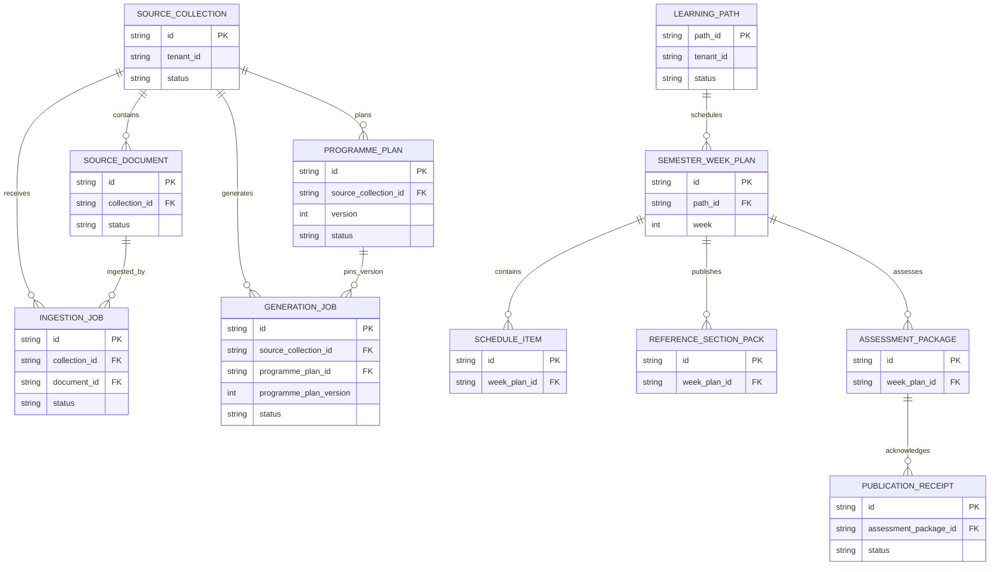
```mermaid
erDiagram
    SOURCE_COLLECTION {
        string id PK
        string tenant_id
        string status
    }

    SOURCE_DOCUMENT {
        string id PK
        string collection_id FK
        string status
    }

    INGESTION_JOB {
        string id PK
        string collection_id FK
        string document_id FK
        string status
    }

    PROGRAMME_PLAN {
        string id PK
        string source_collection_id FK
        int version
        string status
    }

    GENERATION_JOB {
        string id PK
        string source_collection_id FK
        string programme_plan_id FK
        int programme_plan_version
        string status
    }

    LEARNING_PATH {
        string path_id PK
        string tenant_id
        string status
    }

    SEMESTER_WEEK_PLAN {
        string id PK
        string path_id FK
        int week
    }

    SCHEDULE_ITEM {
        string id PK
        string week_plan_id FK
    }

    REFERENCE_SECTION_PACK {
        string id PK
        string week_plan_id FK
    }

    ASSESSMENT_PACKAGE {
        string id PK
        string week_plan_id FK
    }

    PUBLICATION_RECEIPT {
        string id PK
        string assessment_package_id FK
        string status
    }

    SOURCE_COLLECTION ||--o{ SOURCE_DOCUMENT : contains
    SOURCE_COLLECTION ||--o{ INGESTION_JOB : receives
    SOURCE_DOCUMENT ||--o{ INGESTION_JOB : ingested_by
    SOURCE_COLLECTION ||--o{ PROGRAMME_PLAN : plans
    SOURCE_COLLECTION ||--o{ GENERATION_JOB : generates
    PROGRAMME_PLAN ||--o{ GENERATION_JOB : pins_version
    LEARNING_PATH ||--o{ SEMESTER_WEEK_PLAN : schedules
    SEMESTER_WEEK_PLAN ||--o{ SCHEDULE_ITEM : contains
    SEMESTER_WEEK_PLAN ||--o{ REFERENCE_SECTION_PACK : publishes
    SEMESTER_WEEK_PLAN ||--o{ ASSESSMENT_PACKAGE : assesses
    ASSESSMENT_PACKAGE ||--o{ PUBLICATION_RECEIPT : acknowledges
```

These entities come from the formal MVP and Sprint 3 contract migrations. The active App primarily uses `collections`, `documents`, `programmes`, `books`, `lecture_artifacts`, and related operational tables. Keep this reference diagram separate in the formal report.

## 13. Security and trust boundaries

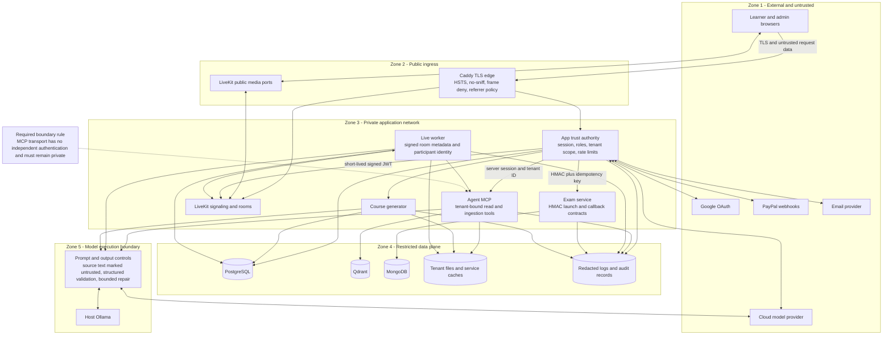
```mermaid
flowchart TB
    subgraph Z1["Zone 1 - External and untrusted"]
        Browser["Learner and admin browsers"]
        OAuth["Google OAuth"]
        PayPal["PayPal webhooks"]
        Email["Email provider"]
        CloudModel["Cloud model provider"]
    end

    subgraph Z2["Zone 2 - Public ingress"]
        Edge["Caddy TLS edge<br/>HSTS, no-sniff, frame deny, referrer policy"]
        Media["LiveKit public media ports"]
    end

    subgraph Z3["Zone 3 - Private application network"]
        App["App trust authority<br/>session, roles, tenant scope, rate limits"]
        Agent["Agent MCP<br/>tenant-bound read and ingestion tools"]
        Worker["Live worker<br/>signed room metadata and participant identity"]
        Exam["Exam service<br/>HMAC launch and callback contracts"]
        LiveKit["LiveKit signaling and rooms"]
        Generator["Course generator"]
    end

    subgraph Z4["Zone 4 - Restricted data plane"]
        PG[("PostgreSQL")]
        QD[("Qdrant")]
        Mongo[("MongoDB")]
        Files[("Tenant files and service caches")]
        Audit[("Redacted logs and audit records")]
    end

    subgraph Z5["Zone 5 - Model execution boundary"]
        LocalModel["Host Ollama"]
        PromptControls["Prompt and output controls<br/>source text marked untrusted, structured validation, bounded repair"]
    end

    Browser -->|"TLS and untrusted request data"| Edge
    Browser <--> Media
    Edge --> App
    Edge --> LiveKit
    Media <--> LiveKit

    App <--> OAuth
    App <--> PayPal
    App --> Email
    App <--> CloudModel

    App -->|"server session and tenant ID"| Agent
    App -->|"short-lived signed JWT"| LiveKit
    App -->|"HMAC plus idempotency key"| Exam
    App --> Generator
    Worker <--> LiveKit
    Worker --> Agent

    App --> PG
    Agent --> QD
    Agent --> Files
    Generator --> PG
    Generator --> Files
    Worker --> PG
    Worker --> Files
    Exam --> Mongo

    Agent --> PromptControls
    Worker --> PromptControls
    Generator --> PromptControls
    PromptControls <--> LocalModel
    PromptControls <--> CloudModel

    App --> Audit
    Agent --> Audit
    Worker --> Audit
    Exam --> Audit
    Generator --> Audit

    MCPWarning["Required boundary rule<br/>MCP transport has no independent authentication and must remain private"]
    MCPWarning -.-> Agent
```

## 14. Course-generation lifecycle — implemented state names

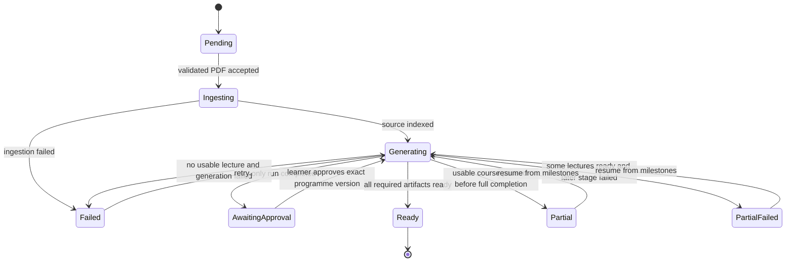
```mermaid
stateDiagram-v2
    [*] --> Pending
    Pending --> Ingesting: validated PDF accepted
    Ingesting --> Generating: source indexed
    Ingesting --> Failed: ingestion failed

    Generating --> AwaitingApproval: plan-only run completed
    AwaitingApproval --> Generating: learner approves exact programme version

    Generating --> Ready: all required artifacts ready
    Generating --> Partial: usable course paused before full completion
    Generating --> Failed: no usable lecture and generation failed
    Generating --> PartialFailed: some lectures ready and later stage failed

    Partial --> Generating: resume from milestones
    Failed --> Generating: retry
    PartialFailed --> Generating: resume from milestones

    Ready --> [*]
```

Per-week milestone states are independently `pending`, `running`, `ready`, `failed`, or `deferred` for the `plan`, `lecture`, `quiz`, `slides`, and `audio` stages.

## 15. Live attendance and reconnect lifecycle — implemented

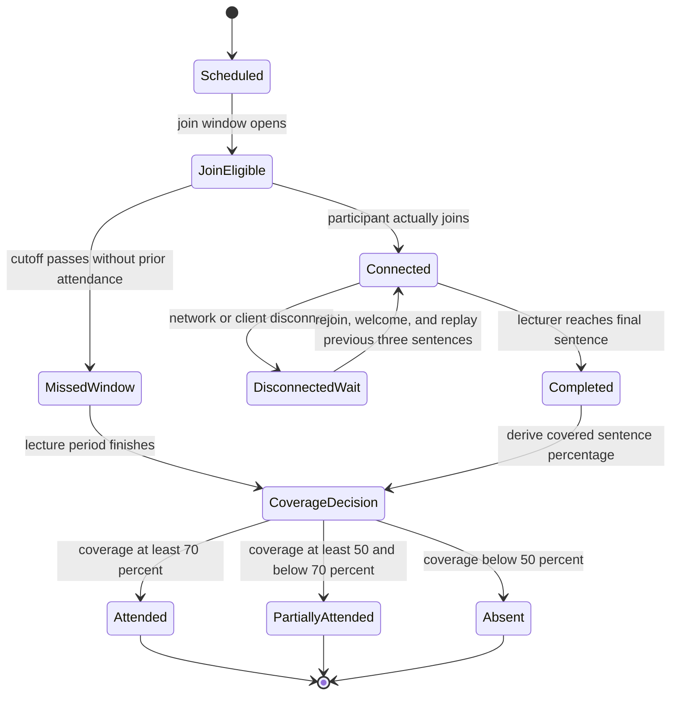
```mermaid
stateDiagram-v2
    [*] --> Scheduled
    Scheduled --> JoinEligible: join window opens
    JoinEligible --> Connected: participant actually joins
    JoinEligible --> MissedWindow: cutoff passes without prior attendance

    Connected --> DisconnectedWait: network or client disconnect
    DisconnectedWait --> Connected: rejoin, welcome, and replay previous three sentences
    Connected --> Completed: lecturer reaches final sentence

    MissedWindow --> CoverageDecision: lecture period finishes
    Completed --> CoverageDecision: derive covered sentence percentage

    state CoverageDecision <<choice>>
    CoverageDecision --> Attended: coverage at least 70 percent
    CoverageDecision --> PartiallyAttended: coverage at least 50 and below 70 percent
    CoverageDecision --> Absent: coverage below 50 percent

    Attended --> [*]
    PartiallyAttended --> [*]
    Absent --> [*]
```

The stored attendance `status` records arrival as `on_time` or `late`; attended, partially attended, and absent are derived participation classifications based on the durable sentence checkpoint.

## 16. Exam session, integrity, and grading lifecycles — implemented

### Session status

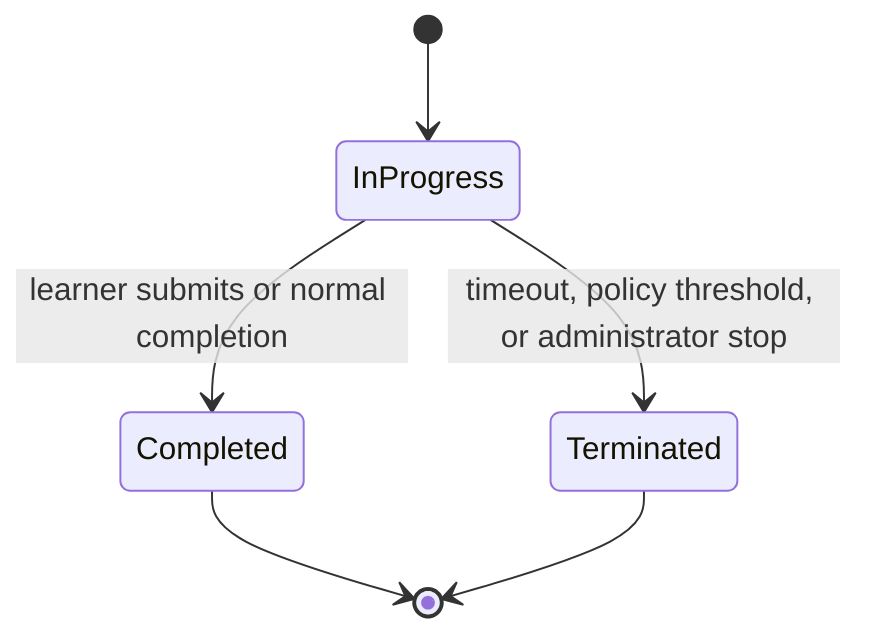
```mermaid
stateDiagram-v2
    [*] --> InProgress
    InProgress --> Completed: learner submits or normal completion
    InProgress --> Terminated: timeout, policy threshold, or administrator stop
    Completed --> [*]
    Terminated --> [*]
```

### Integrity channel state

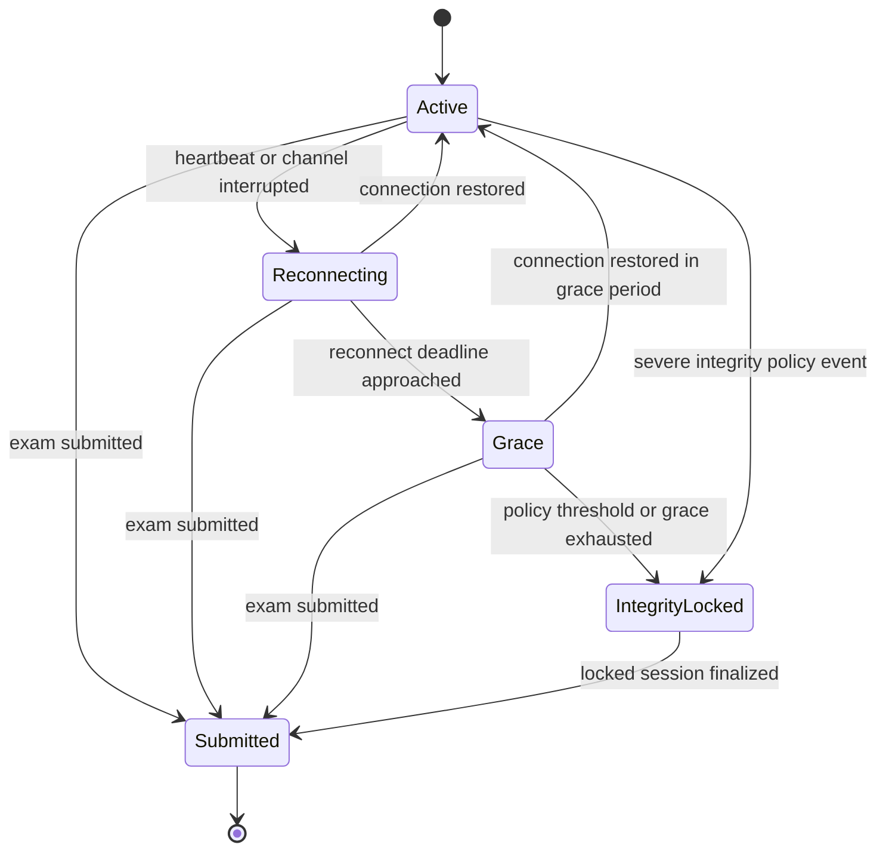
```mermaid
stateDiagram-v2
    [*] --> Active
    Active --> Reconnecting: heartbeat or channel interrupted
    Reconnecting --> Active: connection restored
    Reconnecting --> Grace: reconnect deadline approached
    Grace --> Active: connection restored in grace period
    Grace --> IntegrityLocked: policy threshold or grace exhausted
    Active --> IntegrityLocked: severe integrity policy event
    Active --> Submitted: exam submitted
    Reconnecting --> Submitted: exam submitted
    Grace --> Submitted: exam submitted
    IntegrityLocked --> Submitted: locked session finalized
    Submitted --> [*]
```

### Grading and review status

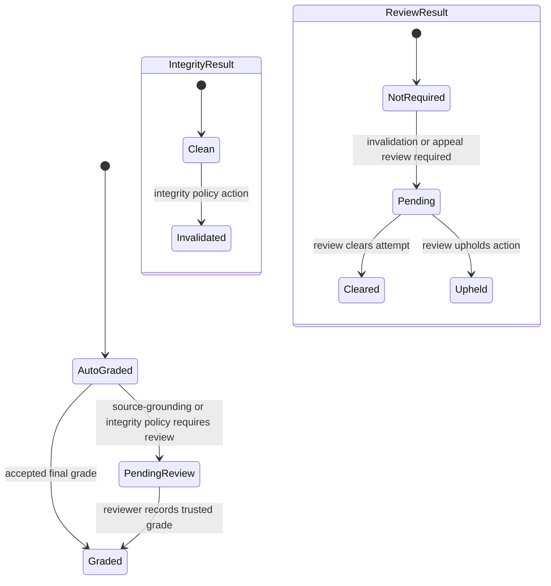
```mermaid
stateDiagram-v2
    [*] --> AutoGraded
    AutoGraded --> PendingReview: source-grounding or integrity policy requires review
    AutoGraded --> Graded: accepted final grade
    PendingReview --> Graded: reviewer records trusted grade

    state IntegrityResult {
        [*] --> Clean
        Clean --> Invalidated: integrity policy action
    }

    state ReviewResult {
        [*] --> NotRequired
        NotRequired --> Pending: invalidation or appeal review required
        Pending --> Cleared: review clears attempt
        Pending --> Upheld: review upholds action
    }
```

## 17. Proposed final-document and validation Gantt

This is a proposed completion schedule anchored to the documentation baseline date. It is not a retrospective claim about historical project dates.

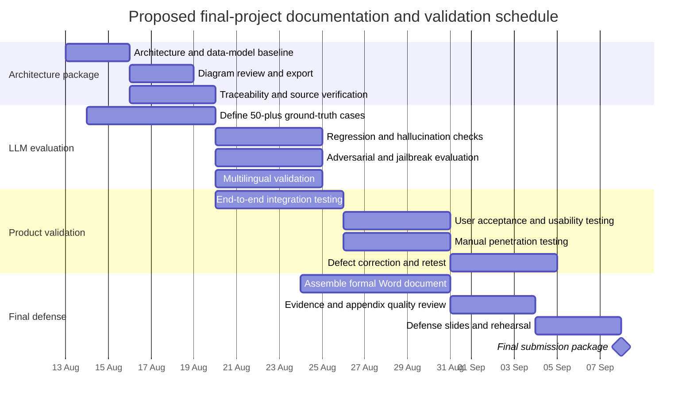
```mermaid
gantt
    title Proposed final-project documentation and validation schedule
    dateFormat YYYY-MM-DD
    axisFormat %d %b

    section Architecture package
    Architecture and data-model baseline     :a1, 2026-08-13, 3d
    Diagram review and export                :a2, after a1, 3d
    Traceability and source verification     :a3, after a1, 4d

    section LLM evaluation
    Define 50-plus ground-truth cases        :e1, 2026-08-14, 6d
    Regression and hallucination checks      :e2, after e1, 5d
    Adversarial and jailbreak evaluation     :e3, after e1, 5d
    Multilingual validation                  :e4, after e1, 5d

    section Product validation
    End-to-end integration testing           :v1, 2026-08-20, 6d
    User acceptance and usability testing    :v2, after v1, 5d
    Manual penetration testing               :v3, after v1, 5d
    Defect correction and retest             :v4, after v2, 5d

    section Final defense
    Assemble formal Word document            :d1, 2026-08-24, 7d
    Evidence and appendix quality review     :d2, after d1, 4d
    Defense slides and rehearsal             :d3, after d2, 4d
    Final submission package                 :milestone, d4, after d3, 0d
```

## Repository evidence map

| Diagram area | Principal repository evidence |
|---|---|
| Components and topology | `docs/architecture.md`, `infra/docker-compose.yml`, `infra/deploy/docker-compose.prod.yml`, `infra/deploy/Caddyfile` |
| PostgreSQL model | `infra/schema.sql`, `infra/migrations/004_app_library.sql`, `010_database_learning_artifacts.sql`, `012_transcripts_certificates.sql`, `025_ai_output_feedback.sql`, `026_live_lecture_resume_attendance.sql` |
| Reference contracts | `infra/migrations/002_final_mvp.sql`, `003_sprint3_learning_flow.sql`, `docs/contracts/final-mvp-contracts.md`, `docs/contracts/sprint-3-learning-flow.md` |
| Upload and generation | `UnivAI-app/app/api/upload/route.ts`, `UnivAI-app/app/api/programmes/route.ts`, `UnivAI-app/lib/generation.ts`, `UnivAI-Agent/generation/lecture_gen.py` |
| LangGraph | `UnivAI-Agent/agents/graph.py`, `UnivAI-Agent/agents/manager.py`, `UnivAI-Agent/mcp_server.py` |
| RAG | `UnivAI-Agent/retrieval/pipeline.py`, `retrieval/hybrid_search.py`, `vector_store/collection_manager.py`, `vector_store/indexing.py` |
| Live teaching and attendance | `UnivAI-live/worker.py`, `UnivAI-live/lecture_progress.py`, `UnivAI-live/qa.py`, `UnivAI-app/lib/attendance-policy.ts` |
| Exam model and flow | `UnivAI-exam_system/src/models/`, `UnivAI-app/app/api/exams/route.ts`, `UnivAI-app/app/api/exams/callback/route.ts` |
| Security and operations | `UnivAI-Agent/docs/prompt-security.md`, `docs/operations/deployment.md`, `docs/operations/observability.md`, `UnivAI-app/lib/session.ts`, `UnivAI-app/lib/rate-limits.ts` |
